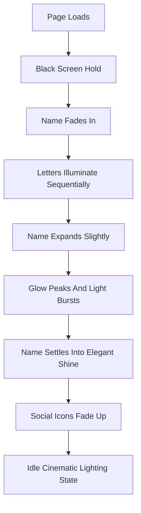

## 1. Product Overview
Create a single-page cinematic portfolio landing page that introduces the owner through one unforgettable opening sequence.
- The page acts as a premium digital title card: minimal content, emotional pacing, and a clear path to social profiles.
- Its value is brand presence and memorability for recruiters, collaborators, and visitors discovering the portfolio on any device.

## 2. Core Features

### 2.1 Feature Module
1. **Landing page**: black cinematic stage, atmospheric lighting, hero name reveal, social icon reveal, subtle interactive idle motion

### 2.2 Page Details
| Page Name | Module Name | Feature description |
|-----------|-------------|---------------------|
| Landing page | Cinematic background | Pure black canvas with layered light rays, soft bloom, and restrained volumetric atmosphere |
| Landing page | Name intro sequence | Centered name fades in, letters illuminate left-to-right, whole word scales up slightly, bloom peaks, burst settles elegantly |
| Landing page | Social links | LinkedIn, GitHub, Instagram, and YouTube icons appear after the hero sequence with fade-up motion and premium hover response |
| Landing page | Mouse interaction | Subtle parallax on the name and slight lighting drift based on pointer movement |
| Landing page | Responsive layout | Desktop-first composition that remains centered, legible, and balanced on tablet and mobile |

## 3. Core Process
The visitor opens the page to full blackness. A cinematic light slowly emerges while the portfolio name appears in the center. Each letter illuminates in sequence, building emotional tension. The full name gently enlarges and blooms, releases a short soft flash, then settles into a refined glow. Social icons fade upward below the name, after which the page transitions into a calm idle state with subtle lighting and pointer-responsive motion.

## 4. User Interface Design
### 4.1 Design Style
- Primary colors: `#000000`, `#ffffff`, and restrained grayscale glow values
- Button/icon style: white outline icon buttons with transparent fill, soft halo, and subtle hover scaling
- Typography: bold modern sans-serif with wide tracking, crisp rendering, and oversized centered hero treatment
- Layout style: single-stage centered composition with generous negative space and layered atmospheric lighting
- Icon style suggestions: minimalist outline marks with consistent stroke weight and circular hit areas

### 4.2 Page Design Overview
| Page Name | Module Name | UI Elements |
|-----------|-------------|-------------|
| Landing page | Cinematic background | Full-viewport black backdrop, diagonal light shafts, soft vignettes, bloom overlays, slow breathing motion |
| Landing page | Hero name | Large centered headline, per-letter glow states, scale-and-bloom climax, fine-tuned spacing |
| Landing page | Social links | Four evenly spaced icon buttons beneath the hero, fade-up stagger, hover glow, subtle scale response |
| Landing page | Idle interactions | Mouse-reactive transform layers, delicate parallax, no abrupt or playful effects |

### 4.3 Responsiveness
Desktop-first layout with a centered focal composition. Typography, icon spacing, and glow intensity scale down progressively for tablet and mobile. Touch devices retain the same motion language using passive ambient animation without relying on hover.
