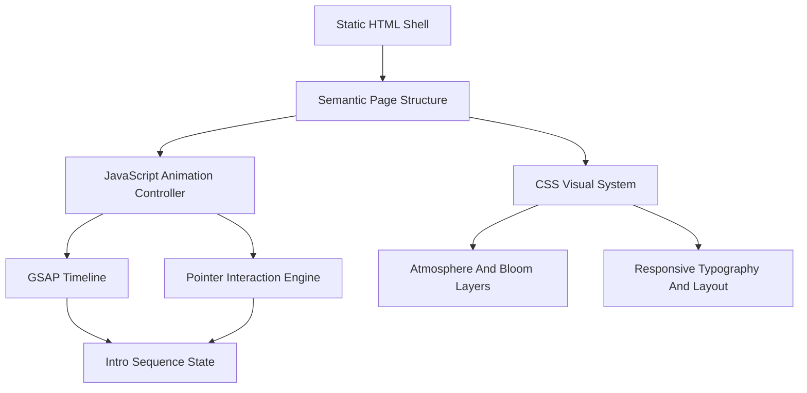

## 1. Architecture Design

## 2. Technology Description
- Frontend: HTML5 + CSS3 + JavaScript ES modules
- Animation: GSAP 3 for intro sequencing, easing, stagger, and state transitions
- Icons: inline SVG markup for precise outline styling and consistent glow behavior
- Lighting effects: CSS gradients, blur, blend modes, layered transforms, and opacity animation; Three.js intentionally avoided for performance and simplicity
- Initialization Tool: None required; the page runs as a lightweight static frontend
- Backend: None
- Data: None

## 3. Route Definitions
| Route | Purpose |
|-------|---------|
| / | Single-page cinematic portfolio landing experience |

## 4. Implementation Structure
| File | Purpose |
|------|---------|
| `index.html` | Semantic document structure, hero markup, icon links, and external font/script loading |
| `styles.css` | Visual system, atmospheric layers, bloom effects, responsive rules, and hover states |
| `script.js` | GSAP intro timeline, per-letter sequencing, icon reveal, idle motion, and pointer response |

## 5. Animation Architecture
- Build the hero name from individual span elements so each letter can be animated independently.
- Use one master GSAP timeline for the full intro sequence: black hold, fade-in, sequential illumination, global scale-up, bloom peak, burst, settle, then icon reveal.
- Drive atmospheric light and headline parallax with a normalized pointer position updated through `requestAnimationFrame`.
- Keep idle motion low amplitude and GPU-friendly by animating `transform`, `opacity`, and filtered overlays instead of layout properties.

## 6. Performance Strategy
- Use only a few large layered elements for lighting to reduce paint overhead.
- Limit blur radius counts and combine glow effects through reusable CSS variables.
- Promote animated layers with `will-change: transform, opacity`.
- Respect reduced-motion preferences by shortening or simplifying non-essential motion while preserving the visual hierarchy.
- Optimize for 60 FPS on modern desktop and mobile browsers by avoiding particle systems and real-time 3D rendering.
